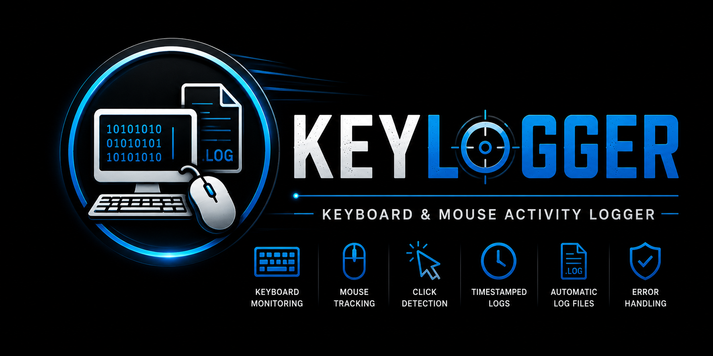

<p align="center">
  
</p>


# ⌨️ Keyboard & Mouse Activity Logger

Monitor keyboard and mouse activity using Python while exploring concepts such as event handling, threading, system monitoring, and log management.

This project records keyboard inputs, mouse movement coordinates, and mouse click events, then stores them in timestamped log files for analysis and educational purposes.

## ✨ Features

* ⌨️ Real-time keyboard activity logging
* 🖱️ Mouse movement monitoring
* 👆 Mouse click detection
* 🧵 Multi-threaded architecture
* 🕒 Timestamped event tracking
* 📄 Separate log files for keyboard and mouse activity
* ⚠️ Automatic error logging for debugging

## 🛠 Technologies Used

* Python
* keyboard
* pyautogui
* pynput
* threading
* datetime

## 📂 Generated Files

### Keyboard Logs

```text
.keys.txt
```

Stores:

* Pressed keys
* Event timestamps
* Log creation date

### Mouse Logs

```text
.mouse.txt
```

Stores:

* Screen resolution
* Mouse coordinates
* Click events
* Event timestamps

### Error Logs

```text
.ERRORlogs.txt
```

Stores:

* Runtime errors
* Exception details
* Debugging information

## 🚀 Installation

Install required packages:

```bash
pip install keyboard pyautogui pynput
```

## ▶️ Usage

Run the application:

```bash
python keylogged.py
```

The program starts:

1. Keyboard monitoring thread
2. Mouse monitoring thread
3. Mouse click listener

All events are automatically recorded in log files.

## 🧠 How It Works

### Keyboard Monitoring

The application continuously listens for keyboard events and records:

* Pressed key
* Time of occurrence

### Mouse Monitoring

The mouse tracker records:

* Cursor coordinates
* Screen resolution
* Position changes

### Click Detection

A dedicated listener captures:

* Left clicks
* Right clicks
* Click location
* Click timestamp

## 🏗 Architecture

```text
Main Program
│
├── Keyboard Thread
│   └── Key Logging
│
├── Mouse Thread
│   └── Position Tracking
│
└── Mouse Listener
    └── Click Detection
```

## 📚 Learning Concepts

This project demonstrates:

* Event-driven programming
* Python threading
* File handling
* Exception management
* System input monitoring
* Concurrent execution
* Activity logging

## ⚠️ Disclaimer

This project was created for educational purposes to explore Python event handling, threading, and system monitoring concepts. Ensure that any usage complies with applicable laws, organizational policies, and user consent requirements.
